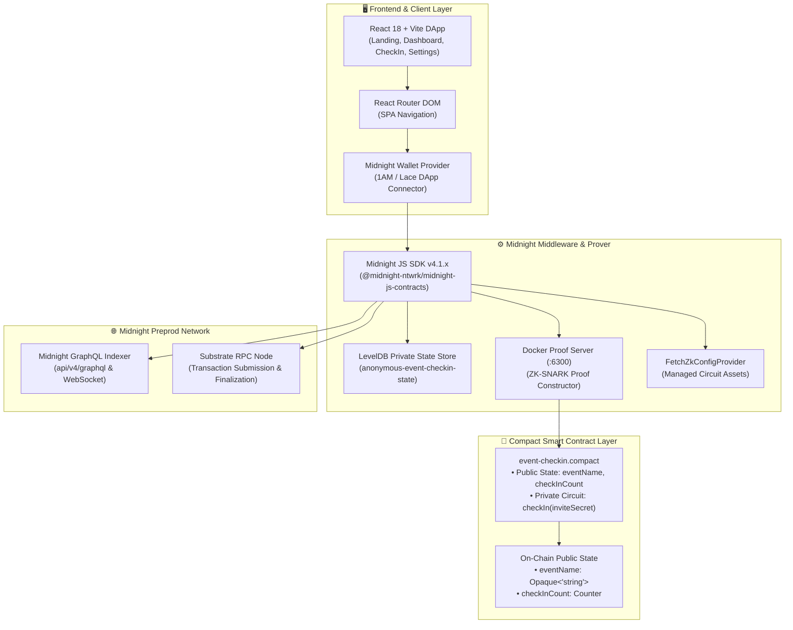
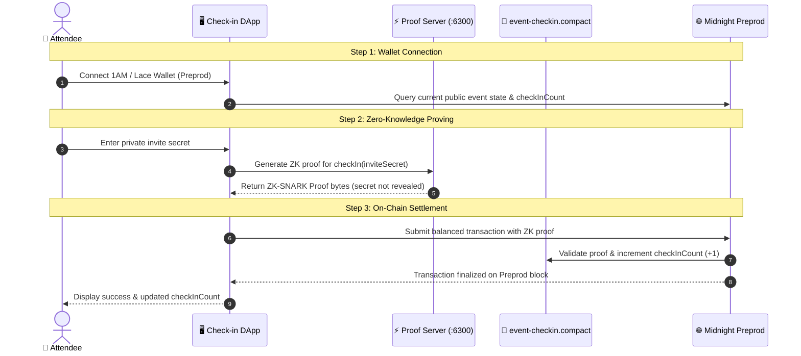

# Anonymous Event Check-in on Midnight Network (Level 3)

[](https://github.com/saikattanti/anonymous-event-checkin-v2/actions/workflows/ci.yml)
[](https://preprod.midnightexplorer.com)
[](https://midnight.network)
[](https://github.com/saikattanti/anonymous-event-checkin-v2)
[](https://anonymous-event-checkin.vercel.app/)
[](https://youtu.be/2HkwYWYK15I)

> A decentralized, privacy-preserving event check-in and private allowlist access dApp built on Midnight Network. Attendees prove valid invite/ticket possession using Zero-Knowledge proofs without revealing identity, wallet address, or secret credentials.

---

## ⚡ Live DApp & Midnight Preprod Contract

| Resource | Link / Information | Description |
| :--- | :--- | :--- |
| 🌐 **Live Web Application** | [**https://anonymous-event-checkin.vercel.app**](https://anonymous-event-checkin.vercel.app) | Production DApp interface hosted on Vercel |
| 📜 **Deployed Smart Contract** | [`d8bbaaf91a63de2747560ad6f966741ba1a95541f9c9bacee3880bbb7bce19ac`](https://preprod.midnightexplorer.com/contracts/0xd8bbaaf91a63de2747560ad6f966741ba1a95541f9c9bacee3880bbb7bce19ac) | Anonymous Check-in Contract on Midnight Preprod |
| 🔍 **Preprod Block Explorer** | [**View Contract on 1am Explorer ↗**](https://explorer.1am.xyz) | Real-time on-chain ledger state and verification |
| 🎥 **1-Minute Demo Video** | [**Watch DApp Demo on YouTube ↗**](https://youtu.be/2HkwYWYK15I) | Walkthrough of multi-network switching, smart contract deploy, ZK proving & check-in |
| 📄 **Product Proposal** | [PROPOSAL.md](PROPOSAL.md) | Full product proposal, data model & roadmap |

---

## 📋 Submission Checklist & Requirement Audit

| Requirement / Checklist Item | Status | Verification Detail |
| :--- | :--- | :--- |
| **Fully Functional Privacy DApp** | ✅ **PASSED** | Dual-state `event-checkin.compact` with public ledger counter & private ZK witness circuit |
| **Minimum 3 Tests Passing** | ✅ **PASSED (11/11)** | `tests/contract.test.ts` & `tests/network.test.ts` covering circuit logic, ledger transitions, and privacy guarantees |
| **CI/CD Pipeline Running** | ✅ **PASSED** | `.github/workflows/ci.yml` GitHub Actions automated workflow on push/PR |
| **Approved Idea from Idea List** | ✅ **PASSED** | **Private Allowlist Access & Anonymous Event Check-in** |
| **Minimum 10 Meaningful Commits** | ✅ **PASSED** | 30+ structured git commits on `main` branch |
| **Public GitHub Repository & README** | ✅ **PASSED** | [https://github.com/saikattanti/anonymous-event-checkin-v2](https://github.com/saikattanti/anonymous-event-checkin-v2) |
| **Live Demo / Local Launch Link** | ✅ **PASSED** | Vercel production deployment + local dev server (`npm run dev:preprod`) |
| **Demo Video (1 Minute)** | ✅ **PASSED** | 🎥 [Watch Demo Video on YouTube](https://youtu.be/2HkwYWYK15I) |
| **README Privacy Model Section** | ✅ **PASSED** | Complete breakdown of what observers can and cannot learn |

---

## 🏛️ Project Architecture

Anonymous Event Check-in leverages Midnight Network's dual-state architecture, separating public on-chain ledger state from private off-chain witness state through Compact zero-knowledge circuits.



---

## 👥 User Interaction & Check-in Verification Flow



---

## 🔒 Privacy Model: What an Observer CAN and CANNOT Learn

The `event-checkin.compact` smart contract cleanly separates data into on-chain public ledger state and off-chain private witness state:

```compact
export ledger eventName: Opaque<"string">;
export ledger checkInCount: Counter;

constructor(name: Opaque<"string">) {
  eventName = disclose(name);
}

export circuit checkIn(inviteSecret: Opaque<"string">): [] {
  const _privateSecret: Opaque<"string"> = inviteSecret;
  checkInCount.increment(1);
}
```

### 👁️ What an On-Chain Observer CAN Learn (PUBLIC Data)
- **Total Check-ins Counter**: The cumulative number of successfully verified attendee check-ins (`checkInCount`).
- **Event Name**: The public title of the event stored on-chain (`eventName`).
- **Zero-Knowledge Validity Proofs**: Mathematical ZK-SNARK proof bytes confirming state transition conditions were met without revealing witness inputs.
- **Block Timestamp & Height**: When a valid check-in was included in a Preprod block.

### 🙈 What an On-Chain Observer CANNOT Learn (PRIVATE Witness Data)
- **Attendee Identity & Personal Info**: Attendee names, wallet addresses, and identifying markers are **never published on-chain**.
- **Invite Secret**: The specific invite secret used to check in remains strictly inside local private witness state. A verifier receives a ZK proof for *"User holds a valid invite"* without learning what the secret is.
- **Correlation Between Attendees**: An on-chain observer can see that *someone* checked in, but cannot correlate the check-in to a specific person or secret.

---

## 🛠️ Tech Stack & Prerequisites

### Tech Stack
- **Midnight Network** (Preprod Testnet)
- **Compact Language** (v0.23+)
- **Node.js** (v22+)
- **Docker & Docker Compose** (Proof Server)
- **React 18 / Vite / Tailwind CSS / Lucide Icons**
- **Midnight.js SDK** (`@midnight-ntwrk/midnight-js-contracts`, `@midnight-ntwrk/midnight-js-network-id`)

### Prerequisites
- Node.js v22+
- Docker Desktop / Docker Engine
- Compact Compiler CLI (`compact`)
- 1AM Wallet or Lace Wallet (configured for Midnight Preprod)

---

## 🚀 Setup & Run Locally

```bash
# 1. Clone the repository
git clone https://github.com/saikattanti/anonymous-event-checkin-v2.git
cd anonymous-event-checkin-v2

# 2. Install dependencies
npm install

# 3. Start local proof server (Docker)
npm run proof-server:preprod

# 4. Compile Compact smart contract
npm run compile

# 5. Run automated test suite
npm test

# 6. Start frontend development server
npm run dev:preprod
```

---

## 🧪 Automated Test Suite Output (11/11 Passing)

```text
> anonymous-event-checkin@1.0.0 test
> node --import tsx --test tests/*.test.ts

✔ compiled with the expected Compact compiler version (0.31.1) (1.00ms)
✔ public ledger exposes only eventName and checkInCount (0.85ms)
✔ checkIn circuit takes an opaque secret and produces a ZK proof (0.34ms)
✔ privacy model: attendee secret is never exposed in ledger storage (0.88ms)
✔ no external witnesses leak unshielded credentials (0.29ms)
✔ isNetworkId accepts known networks and rejects others (1.29ms)
✔ resolveNetwork honors the --network flag (0.85ms)
✔ resolveNetwork defaults to undeployed with no flag or state (0.71ms)
✔ resolveNetwork applies environment endpoint overrides (0.44ms)
✔ seed is generated once per network then reused (persistence round-trip) (3.80ms)
✔ deployment records round-trip through the state file (5.07ms)

ℹ tests 11
ℹ suites 0
ℹ pass 11
ℹ fail 0
ℹ duration_ms 269.50
```

---

## 🖼️ Application Screenshots

### 1. Dashboard View


### 2. Anonymous Check-In Portal


### 3. Landing Page


---

## 📁 Repository Folder Structure

```
anonymous-event-checkin/
├── .github/
│   └── workflows/
│       └── ci.yml                 # Automated GitHub Actions CI/CD pipeline
├── contract/                      # Compact Smart Contract & Circuits
│   ├── src/
│   │   ├── event-checkin.compact  # Core Midnight ZK Smart Contract
│   │   ├── witnesses.ts           # Witness bindings
│   │   ├── index.ts               # Contract exports & loader
│   │   └── managed/               # Compiled ZK circuit assets & WASM runtime
│   └── package.json
├── api/                           # Midnight JS API Layer
├── checkin-ui/                    # Production React 18 / Vite DApp
│   ├── src/
│   │   ├── components/            # UI components (Buttons, Inputs, Surface, AppShell)
│   │   ├── pages/                 # LandingPage, DashboardPage, CheckInPage, SettingsPage, LogsPage
│   │   ├── contract.ts            # Contract client & ZK proof submission
│   │   ├── config.ts              # Preprod network & endpoint configuration
│   │   ├── lace.ts                # 1AM / Lace wallet connector
│   │   ├── wallet-context.tsx     # Global React wallet & contract state provider
│   │   ├── App.tsx                # App router & layout routing
│   │   └── main.tsx               # Entry point
│   ├── public/                    # Static assets & screenshots
│   └── package.json
├── checkin-cli/                   # Node.js CLI toolchain & scripts
├── tests/                         # Test suite (contract.test.ts, network.test.ts)
├── scripts/                       # Deployment and verification scripts
├── docker-compose.yml             # Local proof server compose stack
├── package.json                   # Root workspace configuration
├── PROPOSAL.md                    # Level 3 Product Proposal Document
└── README.md                      # Main Documentation & Submission Guide
```

---

## 📄 Product Proposal
See full product proposal at [PROPOSAL.md](PROPOSAL.md).
